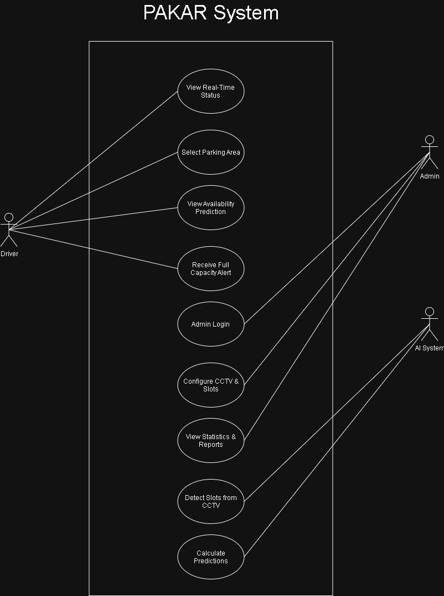
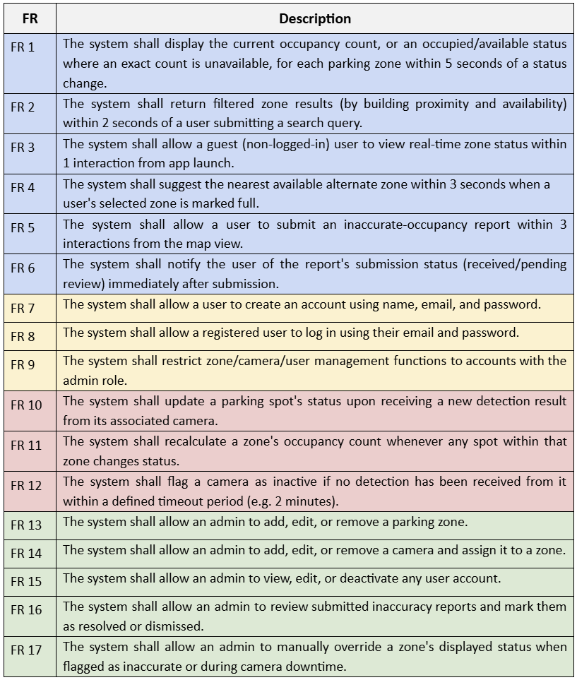
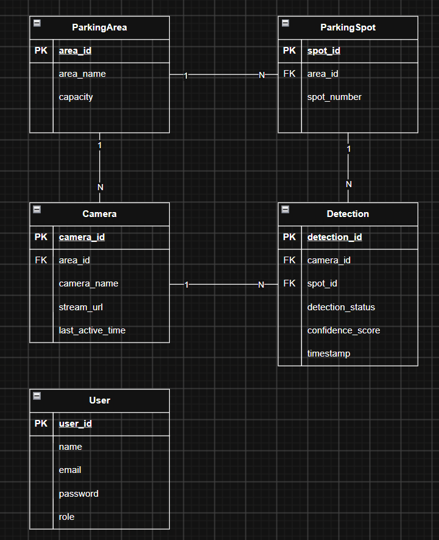
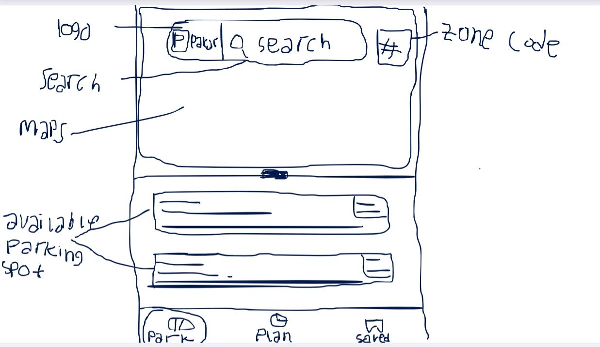
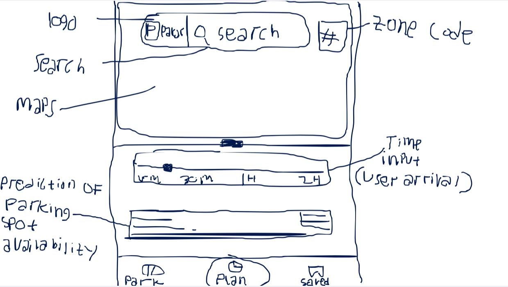
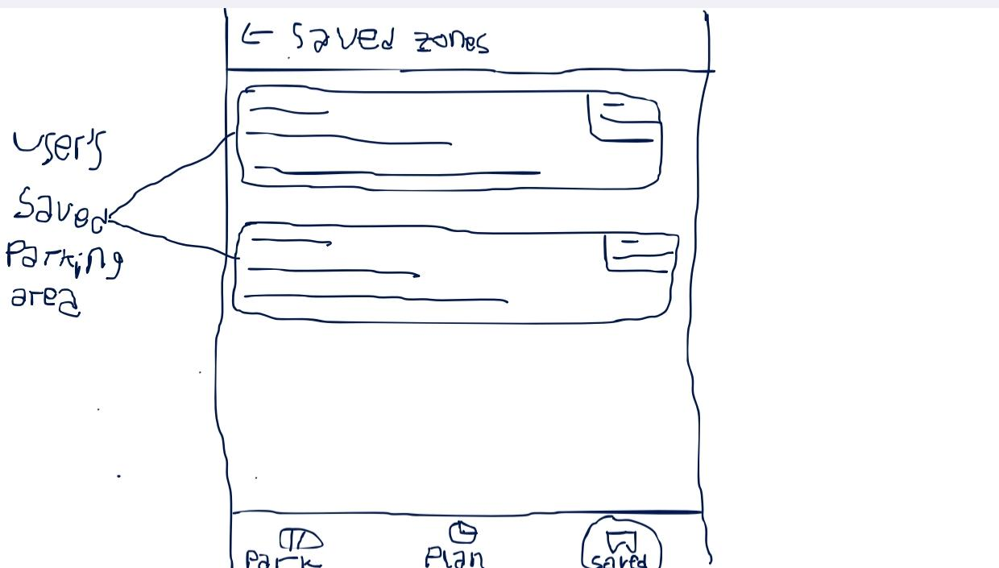
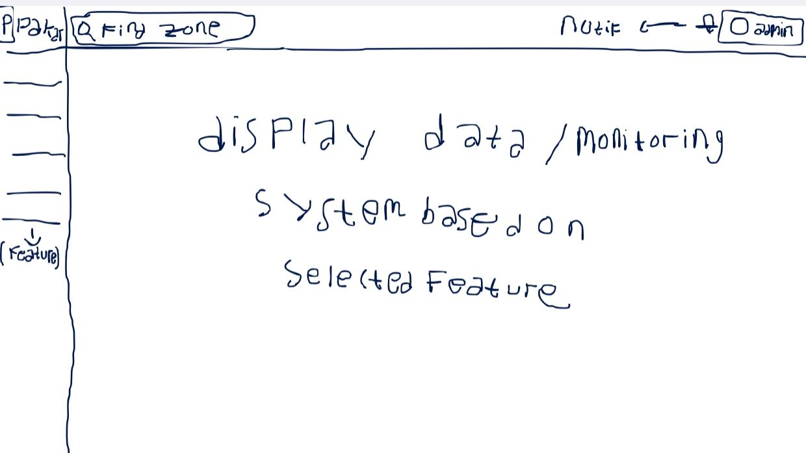
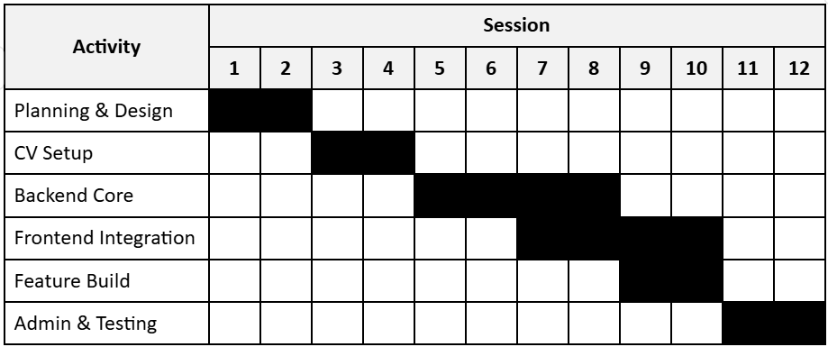

---
layout: default
---

# PAKAR (Parkir Akurat Real Time)

---

## Group 2 Members
1. Ursula Maurentti Amarely - 24/533008/TK/59050
2. Deva Zukannada - 24/546873/TK/60780
3. Nabil Abrian Aryo Prabowo - 24/546496/TK/60770

---

# IT Senior Project
Welcome to our IT Senior Project showcase page.

## Project Background
Limited parking capacity can cause people to spend a significant amount of time searching for an available parking space. This can also lead to congestion around parking areas and make the overall parking experience less convenient.

People often have to go through long lines of waiting outside of the mall or in a university parking area, then go out because the parking spot is full. PAKAR is created to monitor the availability of parking space.
Therefore, our group proposes an Al-based Smart Parking Web Application that provides parking availability information and predicts parking slot availability behavior over time. The system is designed to help people make better decisions about where and when to park.

## Methodology
Agile (Scrum Framework) is used as our methodology, why?
- **Short Timelines:** The project runs across 12 sessions in one semester. Agile helps the team build, test, and release features in small cycles.
- **AI Model Improvement:** Building computer vision models for slot detection and AI forecasting requires continuous testing and model adjustments.
- **Flexibility:** It allows quick changes if the team runs into issues during Azure cloud deployment or CCTV camera integration.

## SDLC Phase 1-3 Design
### a. Product Goals
- Track parking space availability in real time using existing CCTV cameras instead of buying expensive hardware sensors.
- Predict future parking space availability using AI models so drivers can plan ahead.
- Provide parking managers with historical usage data and charts to manage parking spaces better.

### b. Potential Product Users
**End-user (Students, Lecturers, Staff)** 
- Want to check real-time parking spot availability on a web dashboard.
- Need predictions for available spots during peak campus hours.
- Want alerts when a parking lot is completely full.

**Administrators**
- Need an affordable parking tracking system using existing CCTV cameras.
- Want to view historical parking usage data through simple charts.
- Need warning alerts when parking spaces reach full capacity.

### c. Use Case Diagram

### d. Functional Requirements

### e. Entity Relationship Diagram

### f. Low-Fidelity Wireframe
**User Interface**

**Admin Interface**

### g. Gantt-Chart of Project Execution over 1 semester

